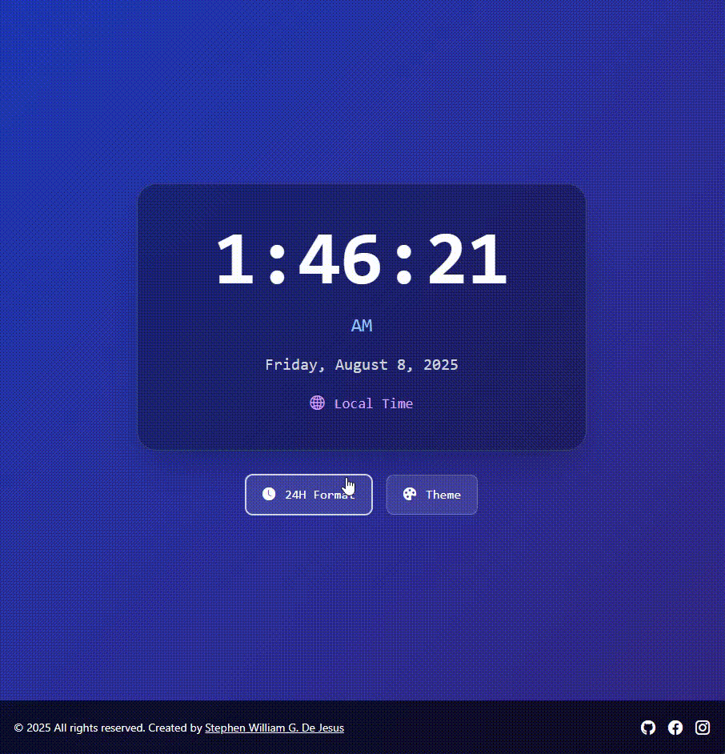
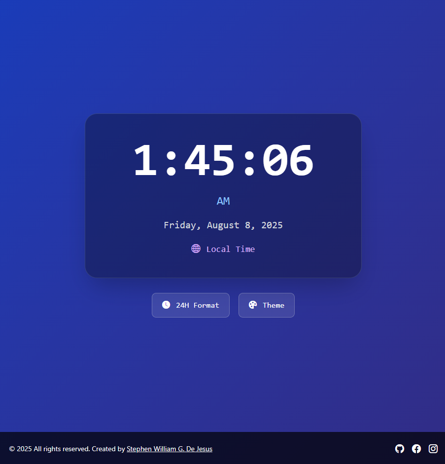

# ⏰ Digital Clock – Real-Time Local Time Display
A modern, responsive digital clock application built with **HTML**, **Tailwind CSS**, and **JavaScript**.  
Features real-time local time display, 12/24 hour format toggle, dynamic theme switching, and a sleek modern interface!

Crafted by **[Stephen William G. De Jesus](https://www.facebook.com/stephenwilliam.dejesus.5/)**, this project showcases clean UI design, accessibility features, and smooth JavaScript interactions.

---

## 📸 Preview  
### 🎞️ Live Interaction (Video)  

### 🖼️ Application Screenshot  


---

## 🌐 Live Demo  
[View Live Demo](https://bogiiiie.github.io/14-javascript-digital-clock/) 
---

## ✨ Features
- ⏰ **Real-Time Clock** – Live time updates every second
- 🕐 **Format Toggle** – Switch between 12-hour and 24-hour formats
- 🎨 **Dynamic Themes** – 5 beautiful gradient background themes
- 📅 **Date Display** – Full date with weekday, month, day, and year
- 🌍 **Local Time Zone** – Automatically uses your local time zone
- 📱 **Responsive Design** – Optimized for all screen sizes
- ♿ **Accessibility Ready** – Full ARIA support and semantic HTML
- 🎯 **Clean Interface** – Modern glassmorphism design with smooth animations
- 🔗 **Social Links** – Quick access to developer's profiles
- ⚡ **Lightweight** – Fast loading with minimal dependencies

---

## 🎮 How to Use
1. **View Time** – The clock displays your current local time automatically
2. **Toggle Format** – Click "24H Format" to switch between 12/24 hour display
3. **Change Theme** – Click "Theme" button to cycle through color schemes
4. **Connect** – Use footer links to visit developer's social profiles

---

## ⏰ Time Features & Display
```
12-Hour Format: 12:34:56 PM
24-Hour Format: 12:34:56
Date Format: Monday, January 8, 2025
Update Interval: Every 1 second
Time Zone: Automatic local detection
```

---

## 🎨 Available Themes
- **Default Blue** – Classic blue to indigo gradient
- **Pink Cyan** – Vibrant pink to cyan gradient  
- **Green Nature** – Fresh green to dark green gradient
- **Sunset Orange** – Warm orange to red gradient
- **Purple Pink** – Royal purple to pink gradient

---

## 🛠️ Built With
- [HTML5](https://developer.mozilla.org/en-US/docs/Web/Guide/HTML/HTML5) – Semantic structure and accessibility
- [Tailwind CSS](https://tailwindcss.com/) – Utility-first responsive styling
- [JavaScript ES6+](https://developer.mozilla.org/en-US/docs/Web/JavaScript) – Real-time functionality
- [Font Awesome](https://fontawesome.com/) – Icons and visual elements
- [Bootstrap Icons](https://icons.getbootstrap.com/) – Additional UI icons
- [Google Fonts (Poppins)](https://fonts.google.com/specimen/Poppins) – Modern typography

---

## 📁 Project Structure
```
14-javascript-digital-clock/
├── images/
│   ├── demo.mp4        # Application demo video
│   └── demo.png        # Screenshot preview
├── node_modules/       # Node.js dependencies
├── src/
│   ├── input.css       # Tailwind CSS source file
│   ├── index.html      # Main HTML structure
│   ├── output.css      # Compiled Tailwind CSS
│   ├── package-lock.json # Dependency lock file
│   ├── package.json    # NPM package configuration
│   └── script.js       # JavaScript functionality
└── README.md           # Project documentation
```

---

## 🚀 Getting Started
To run this project locally:

```bash
git clone https://github.com/bogiiiie/14-javascript-digital-clock.git
cd 14-javascript-digital-clock
open src/index.html
```

For development with Tailwind CSS:
```bash
npm install
npm run build-css
```

No additional build process required – just open `src/index.html` in your browser!

---

## 🎯 Key Functions
- **`updateTime(isHour12FormatParam)`** – Updates clock display with current time
- **`updateDate()`** – Refreshes date display with current date
- **`toggleFormatBtn.onclick`** – Handles 12/24 hour format switching
- **`toggleThemeBtn.onclick`** – Cycles through gradient background themes
- **`setInterval()`** – Ensures real-time updates every second

---

## ♿ Accessibility Features
- 🏷️ **Semantic HTML** – Proper time elements and ARIA labels
- 📢 **Screen Reader Support** – Descriptive labels for all interactive elements
- ⌨️ **Keyboard Navigation** – Full keyboard accessibility
- 🎯 **Focus Management** – Clear focus indicators on buttons
- 📱 **Responsive Design** – Works with screen magnification
- 🔊 **Live Regions** – Time updates announced to screen readers
- 📝 **Alternative Text** – Descriptive button labels and icons

---

## 📱 Responsive Layout
- **Desktop** – Centered layout with large clock display
- **Tablet** – Optimized spacing with touch-friendly controls  
- **Mobile** – Stacked vertical layout for easy interaction
- **All Screens** – Fluid typography and adaptive spacing

---

## 🎨 UI/UX Features
- **Glassmorphism Design** – Semi-transparent cards with blur effects
- **Gradient Backgrounds** – 5 dynamic color theme options
- **Smooth Transitions** – Hover effects and button animations
- **Visual Hierarchy** – Clear typography scale and spacing
- **Interactive Feedback** – Button states and hover effects
- **Modern Typography** – Clean Poppins font family
- **Ring Effects** – Subtle border rings with opacity

---

## 🕐 Technical Details
### Time Formatting
- Uses JavaScript's `toLocaleTimeString()` for consistent formatting
- Automatic AM/PM detection in 12-hour mode
- Second-precision updates with smooth transitions

### Theme System
- Array-based theme storage for easy expansion
- CSS class manipulation for smooth theme transitions
- Persistent theme cycling with index tracking

### Performance
- Efficient DOM updates with targeted element selection
- Minimal reflow/repaint with smart class management
- Lightweight JavaScript with no external dependencies

---

## 🔗 Connect with Me
- 💻 **GitHub**: [@bogiiiie](https://github.com/bogiiiie)
- 📘 **Facebook**: [Stephen William De Jesus](https://www.facebook.com/stephenwilliam.dejesus.5/)
- 📷 **Instagram**: [@stephenwilliamdejesus](https://www.instagram.com/stephenwilliamdejesus/)

---

## 👨‍💻 Author
Created by **[Stephen William G. De Jesus](https://www.facebook.com/stephenwilliam.dejesus.5/)**

---

## 📄 License
© 2025 All rights reserved. Created by Stephen William G. De Jesus.

---

## 🚀 Future Enhancements
- ⏰ **Multiple Time Zones** – Display world clocks
- ⏲️ **Timer & Stopwatch** – Additional time utilities
- 🔔 **Alarm Feature** – Set custom alarms
- 🌙 **Auto Dark Mode** – Time-based theme switching
- 💾 **Settings Persistence** – Remember user preferences
- 🎵 **Sound Options** – Hourly chimes or tick sounds
- 📊 **Time Analytics** – Track usage patterns
- 🎨 **Custom Themes** – User-created color schemes
- 📱 **PWA Support** – Install as mobile app
- 🌐 **Internationalization** – Multiple language support
